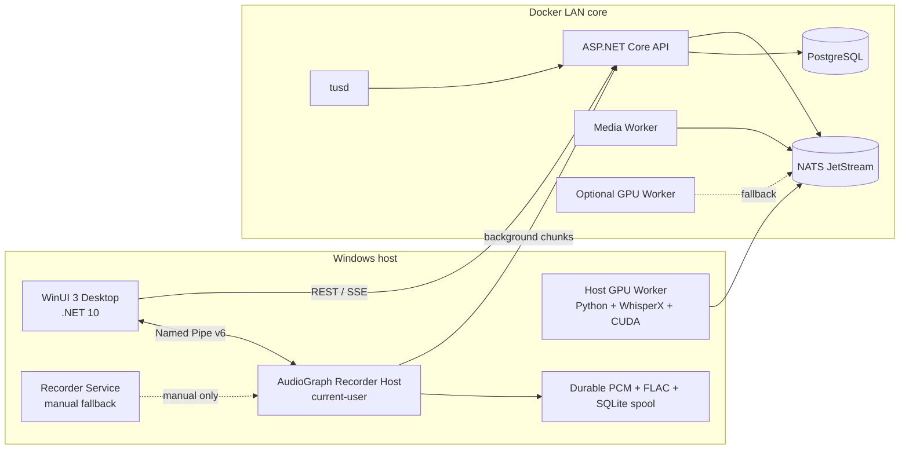

# Текущая архитектура

## Размещение компонентов

## Что является текущим runtime

Поддерживаемая конфигурация — Docker core + current-user AudioGraph capture +
host ML. Windows запускает Desktop, AudioGraph Recorder Host из Program Files и
host GPU Worker. Legacy Recorder Service остаётся остановленным ручным fallback.
WhisperX и CUDA загружаются из локального Python окружения; container GPU Worker
остаётся резервным режимом.

## Границы ответственности

### API и workers

API владеет аутентификацией, сессиями, встречами, media metadata, заданиями и
версиями transcript. Media Worker собирает корректный input, GPU Worker выполняет
ASR и enrichment, сохраняя heartbeat и lease в PostgreSQL/NATS.

### Recorder Host

Host снимает выбранный microphone через AudioGraph, преобразует Float32 в mono
PCM16, пишет 30-секундные raw-сегменты и регистрирует их в SQLite. После STOP raw
становится `LOCAL_READY`; отдельный SQLite-driven encoder строит FLAC с retry,
после чего delivery coordinator загружает готовые чанки и выполняет server finalize.
Для ONLINE доступны независимые дорожки `room-microphone` и `system-audio` с общей
временной шкалой; они не смешиваются на границе захвата. Live ASR получает их через
неблокирующий tap, а каноническая V1/V2 всегда строится из исходных дорожек.

### Desktop

Desktop показывает фактические состояния API, Host, raw/encoder/archive/delivery и
processing, отправляет пользовательские команды и подписывается на SSE с polling
fallback. ML-бизнес-логика остаётся в API/worker.

## Источники истины и надёжность

- PostgreSQL — состояние пользователей, meetings, jobs, media, transcript и audit.
- NATS JetStream — доставка событий и redelivery, но не единственное хранилище.
- SQLite spool — локальное состояние Host до подтверждённой доставки.
- Durable PCM/FLAC archive — локальная копия записи; её нельзя удалять при
  временной ошибке API или encoder.
- `artifacts/runtime/state.json` — диагностический снимок, не бизнес-состояние.

## Архитектурный контракт обработки

Серверный ML-код вызывается через единый фасад
[`WhisperXCorePipeline`](../whisperx_atom/core_pipeline.py), а допустимые стадии
проверяются общим контрактом [`pipeline_contract.py`](../whisperx_atom/pipeline_contract.py).
Это совместимый слой над текущим `ProcessingService`: он не меняет IPC/API или
формат существующих stages, но не позволяет worker-модулям напрямую расширять
legacy pipeline несогласованными состояниями. Подробная схема перехода описана
в [architecture-incremental.md](architecture-incremental.md).

Legacy `app.py`, `app/` и watch/runtime-файлы сохранены для совместимости, но не
образуют второй поддерживаемый server pipeline.
