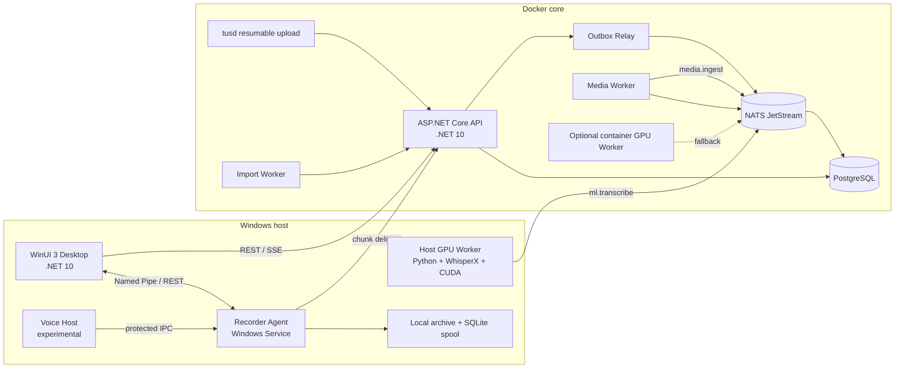

# Текущая архитектура

## Размещение компонентов

## Что является текущим runtime

Поддерживаемая конфигурация — Docker core + host ML:

- Docker: PostgreSQL, NATS JetStream, ASP.NET API, tusd, outbox relay, import worker и media worker.
- Windows: Recorder Service, Desktop и host GPU Worker.
- WhisperX и CUDA загружаются из локального Python окружения, указанного в `WHISPERX_HOST_PYTHON`.
- `GPU_WORKER_RUNTIME=host` и `GPU_WORKER_MODE=host` устанавливаются запускателем.
- container GPU Worker остаётся резервным режимом для машины с доступным CUDA-образом.
- `summary-worker`, `llama-server`, web и gateway не нужны для Transcript MVP и не запускаются обычным `run-whisperx.ps1`.

## Границы ответственности

### API

API владеет аутентификацией, сессиями, встречами, media metadata, заданиями, transcript/summary версиями, speakers, assistant conversations, decisions, tasks, agents и аудитом. API не загружает WhisperX-модели и не обрабатывает полное аудио в своём процессе.

### Media Worker

Проверяет media, собирает и нормализует дорожки, использует FFmpeg/FFprobe, сохраняет производные файлы и передаёт корректный input в ML pipeline.

### GPU Worker

Забирает задания из NATS, удерживает DB lease и JetStream delivery для длинных jobs, выполняет WhisperX ASR, alignment, diarization и persistence результата. Worker публикует heartbeat в `worker_instances`.

### Recorder Agent

Снимает WASAPI microphone/loopback, создаёт FLAC-чанки, считает SHA-256, хранит spool и локальный архив, связывает с серверной meeting/session и повторяет delivery после восстановления.

### Desktop

Показывает фактические состояния API, Agent и processing, отправляет пользовательские команды и подписывается на SSE с polling fallback. ML-бизнес-логика остаётся в API/worker, а не в XAML.

## Источники истины и надёжность

- PostgreSQL — состояние пользователей, meetings, jobs, media, transcript, worker heartbeat и audit.
- NATS JetStream — доставка событий и возможность redelivery, но не единственное хранилище.
- SQLite spool — локальное состояние Agent до подтверждённой доставки.
- Локальный архив — постоянная копия записи; его нельзя удалять при временной ошибке API.
- `artifacts/runtime/state.json` — диагностический снимок запуска, не источник бизнес-состояния.

Legacy `app.py`, `app/` и отдельные watch/runtime-файлы сохранены для совместимости. В поддерживаемом запуске они не образуют второй параллельный server pipeline.
