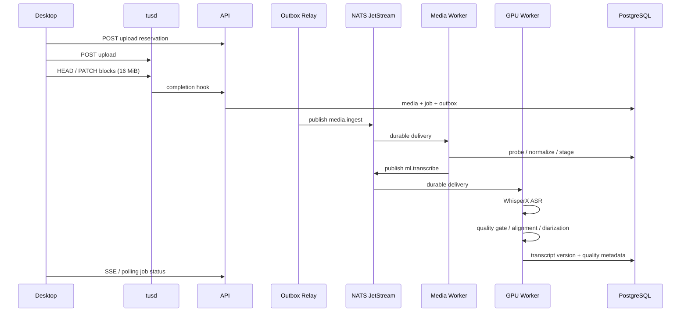
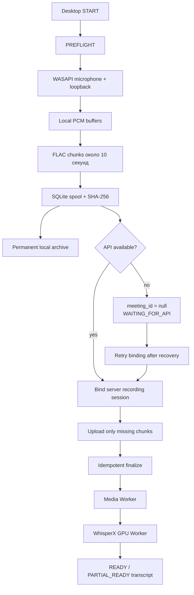

# Потоки данных

## Файл → стенограмма



TUS resume выполняется через `HEAD` и чтение `Upload-Offset`; при ошибке повторяется текущий блок, а не весь файл. После подтверждённого блока retry counter сбрасывается.

## Запись → серверная обработка



## Processing status

Типовая последовательность: `VALIDATING → UPLOADING → MEDIA_PROCESSING → TRANSCRIBING → ALIGNING → DIARIZING → TRANSCRIPT_READY` или `PARTIAL_READY`. Ошибка обязательного ASR приводит к `FAILED`; ошибка optional alignment/diarization сохраняет пригодный ASR-текст.

## Идентификаторы корреляции

Для диагностики сохраняется цепочка:

```text
recording_session_id
  → meeting_id
  → media_asset_id
  → job_id
  → trace_id
```

Локальный `recording_session_id` не заменяет серверный `meeting_id`. При offline-start встреча создаётся только после восстановления связи, а уже записанный spool привязывается к реальному идентификатору.
